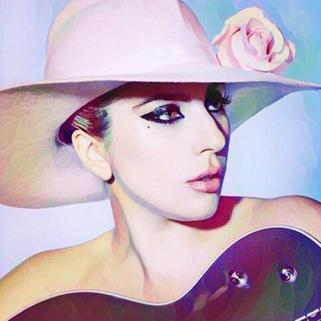
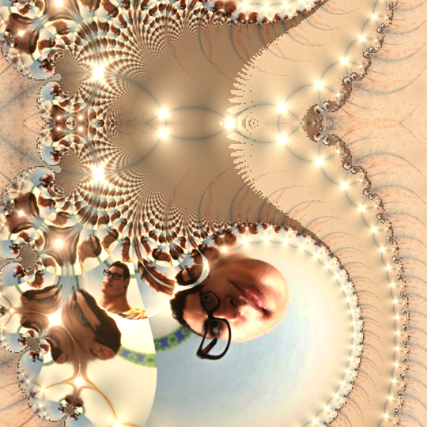
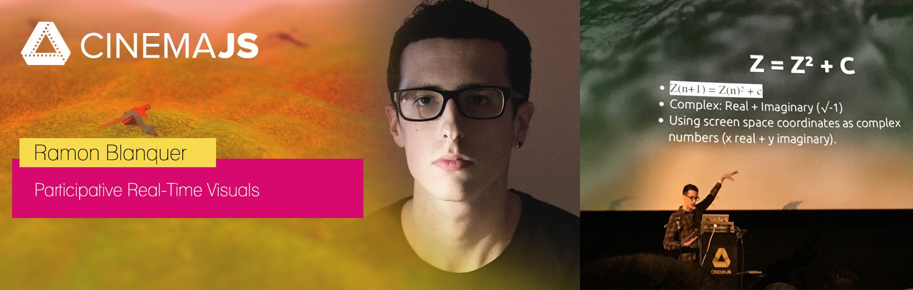
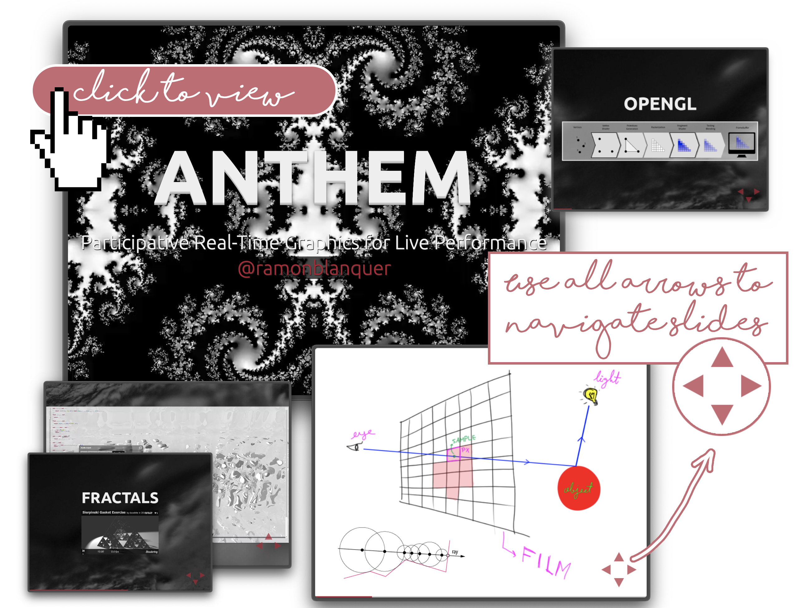
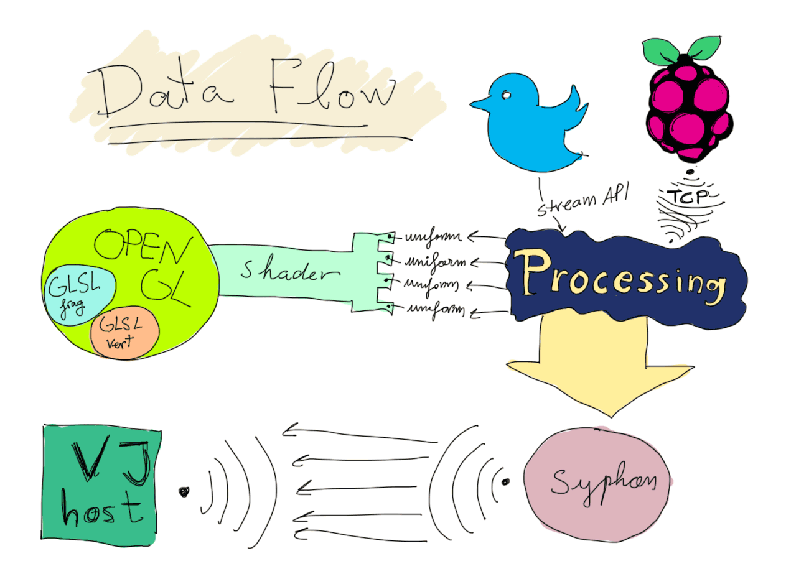
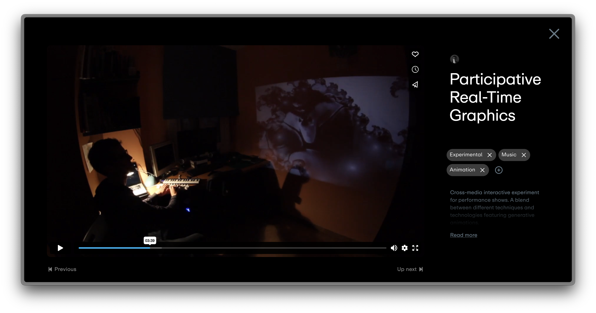

# Ariviz

> **Participative real-time graphics**
>
> A cross-media interactive experiment for live performance shows—blending
> various techniques and technologies to create generative animations.

<table>
  <tr>
    <td>
      
    </td>
    <td>
      
    </td>
  </tr>
  <tr>
    <td>
      
    </td>
    <td>
      
    </td>
  </tr>
</table>

This project was selected to be presented at CinemaJS, as part of a series of
creative web development... in a cinema! A more detailed explanation can be
found in [my website](https://www.ramn.dev/work/ariviz).

I published the slides I used during the presentation. When navigating them make
sure you use not only left-right but also up down. I talked about pixel shaders,
raymarching (or sphere tracing) and how the data flows in my demos.

With this project, I wanted to challenge the idea that computer graphics are
only meant for VFX or video games. I demonstrated how real-time visuals could be
driven by diverse input sources:

- **Live MIDI from the artist**: Feeding values into shaders using a VJ
  production package.
- **Raspberry Pi orientation (Sense HAT)**: Streaming sensor data via TCP
  sockets.
- **Live tweets (#hashtags)**: Extracting images and parsing tweet content in
  real-time.

The core idea was to break the passive dynamic of live shows—where the audience
simply consumes the experience—and instead explore **ways for the audience to
actively participate** in the performance itself.

This project bridges real-time data input with live visual performance using a combination of technologies.

A `Raspberry Pi` with a `Sense Hat` (a gyroscope and accelerometer in my case)
connects to a computer via a `TCP` client, where a `Processing` sketch listens
for incoming tweets. These tweets are parsed and converted into parameters to
animate `OpenGL` shader geometry by manipulating their `uniforms`. The rendered
visuals are then sent to `Resolume`—a professional-grade `VJ` (Visual Jockeying)
application—via `Syphon`, allowing seamless integration of audio features like
the DJ's beats or any other reactive elements `Resolume` supports.

As part of this setup, the project also demonstrates how to build an `FFGL`
plugin, which wraps `OpenGL` shaders and exposes their `uniforms` to popular VJ
software used in live music productions. The result is a compiled binary plugin
that can be dragged into a production environment and mapped to `MIDI`, `BPM`,
frequency thresholds, or any input available in the host application—making it
ready for professional use in clubs, raves, or stage shows.

See it in action by clicking the video link below:

Folder structure:

- `/ableton`: Ableton music performance project.
- `/composition`: Resolume Arena compositions and setups.
- `/processing`: Processing project in .pde format.
- `/proof`: Proof of concept of the client-server web socket.
- `/dist`: FFGL plugin as Binary for Mac OS (.bundle) Windows (.dll) and
  Processing sketch already compiled and built.
- `/report`: Report written for this experiment.
- `/synth`: GLSL Synthclipse shader development project.
